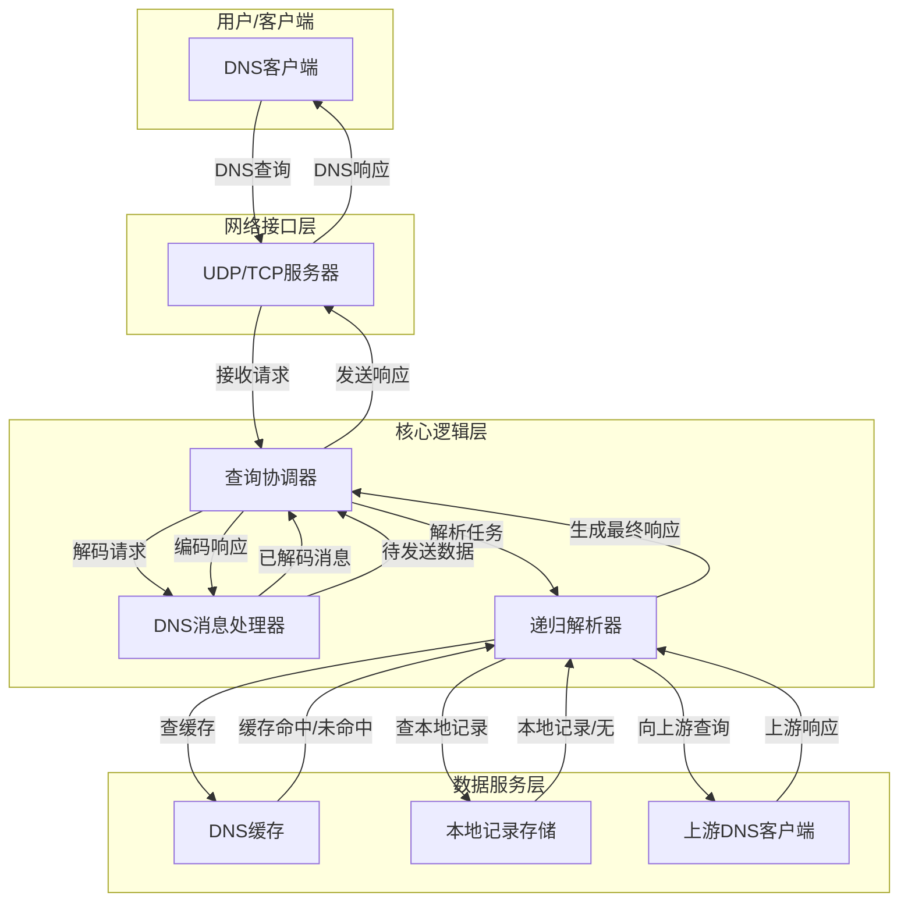

# 实现文档1：系统架构设计

## 1.1 架构概述

本DNS服务项目的核心是构建一个**模块化、可扩展、高性能**的DNS解析器。整体架构采用分层设计，确保各层职责单一，便于独立开发、测试和维护。

### 1.1.1 设计目标
- **标准兼容**：完全遵循RFC1034和RFC1035规范。
- **高性能**：通过异步IO和高效缓存机制，支持高并发查询。
- **可扩展性**：能够轻松添加新的资源记录类型、查询策略或插件。
- **易于维护**：清晰的代码结构和文档，降低长期维护成本。

### 1.1.2 分层架构

系统架构分为三层：**网络接口层**、**核心逻辑层**和**数据服务层**。



## 1.2 核心模块（包）设计

为了匹配上述分层架构，项目的Java包结构规划如下：

```
com.dns
├── Main.java              # 应用程序入口，负责组装和启动服务
│
├── server/                # 网络接口层
│   ├── UdpServer.java     # 监听和处理UDP请求
│   └── TcpServer.java     # 监听和处理TCP请求
│
├── processor/             # 核心逻辑层
│   ├── QueryCoordinator.java # 查询协调器，负责调度整个查询流程
│   └── RecursiveResolver.java# 递归解析器，实现核心的域名解析逻辑
│
├── message/               # DNS消息处理
│   ├── MessageParser.java   # 负责将字节流解析成DNS消息对象
│   ├── MessageBuilder.java  # 负责将DNS消息对象构建成字节流
│   └── model/             # DNS消息的数据模型
│       ├── Header.java
│       ├── Question.java
│       └── ResourceRecord.java
│
├── cache/                 # 数据服务层 - 缓存
│   ├── DnsCache.java      # 缓存接口
│   └── InMemoryDnsCache.java # 基于内存的缓存实现
│
├── storage/               # 数据服务层 - 本地记录
│   ├── RecordStore.java   # 本地记录存储接口（例如，用于Host文件或Zone文件）
│   └── ConfigFileRecordStore.java # 从配置文件加载记录的实现
│
└── client/                # 数据服务层 - 上游客户端
    └── UpstreamClient.java  # 负责向其他DNS服务器发起查询
```

## 1.3 数据流说明

1.  **请求接收**：`UdpServer`或`TcpServer`通过Java NIO接收到原始的DNS查询字节流。
2.  **查询分发**：网络服务器将接收到的数据包（和客户端信息）交给`QueryCoordinator`。
3.  **消息解码**：`QueryCoordinator`调用`MessageParser`将字节流解码为结构化的`Message`对象。
4.  **解析执行**：`QueryCoordinator`将解析任务委托给`RecursiveResolver`。
5.  **缓存查询**：`RecursiveResolver`首先查询`DnsCache`。如果命中且记录未过期，则直接构建响应。
6.  **本地记录查询**：如果缓存未命中，则查询`RecordStore`，看是否有本地权威记录。
7.  **递归查询**：如果本地也无记录，`RecursiveResolver`将通过`UpstreamClient`向根DNS服务器或其他上游服务器发起迭代查询。
8.  **结果缓存**：从上游服务器获得最终结果后，`RecursiveResolver`会将其存入`DnsCache`以备后续使用。
9.  **响应构建**：`RecursiveResolver`将最终结果返回给`QueryCoordinator`。
10. **消息编码**：`QueryCoordinator`调用`MessageBuilder`将`Message`对象编码为字节流。
11. **响应发送**：`QueryCoordinator`通过`UdpServer`或`TcpServer`将响应字节流发回给原始客户端。

## 1.4 未来扩展性考虑

- **插件化解析器**：`RecursiveResolver`的设计将考虑支持插件，例如，可以加入一个DNSSEC验证插件。
- **多种缓存后端**：`DnsCache`通过接口定义，未来可以方便地替换为其他实现，如Redis缓存。
- **管理API**：可以增加一个HTTP接口层，用于动态管理配置、查看缓存状态等。 